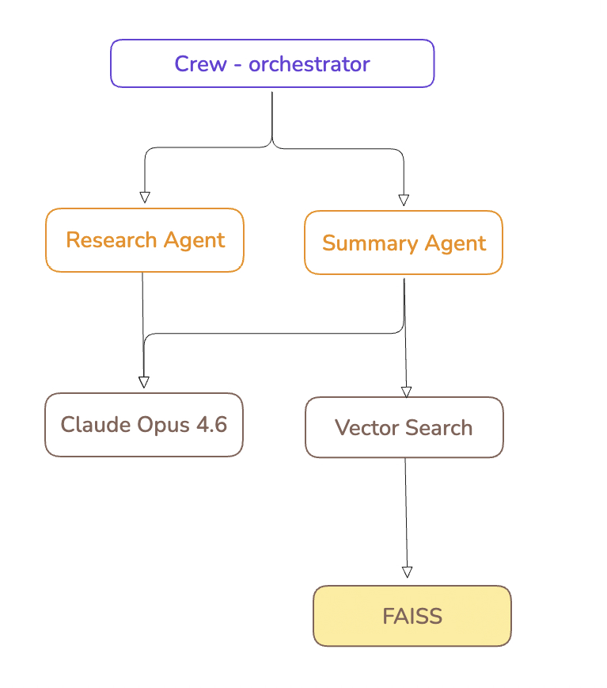

# OpenGuardrail Atlas

Automated AI system inventory, dependency mapping, and risk classification.

[](https://opensource.org/licenses/Apache-2.0)
[](https://www.python.org/downloads/)

---

## About

Atlas performs static analysis on codebases to produce a structured inventory of AI system components, map their dependency relationships, and classify system-level risk. Output is a [CycloneDX](https://cyclonedx.org/) AI Bill of Materials (AIBOM).

No runtime access or credentials required. Analysis operates on source code only.

## Key Capabilities

| Capability | Description |
|-----------|-------------|
| **Discovery** | Identifies AI components using AST-based source code analysis |
| **Dependency Mapping** | Resolves component relationships into a directed architecture graph |
| **Risk Classification** | Evaluates risk aligned with EU AI Act, NIST AI RMF, and ISO/IEC 42001 |
| **AIBOM Generation** | Produces CycloneDX documents in JSON or XML |

## Supported Frameworks

| Framework | Detected Components |
|-----------|-------------------|
| LangChain | Models, agents, chains, tools, retrievers, vector stores, memory |
| CrewAI | Agents, tasks, orchestrators |
| Microsoft AutoGen | Agents, group chats, orchestrators |
| Direct API clients | OpenAI, Anthropic, Google AI, Cohere, HuggingFace |
| Vector databases | Chroma, Pinecone, Qdrant, Weaviate, Milvus, FAISS |

## Installation

```bash
pip install openguardrail-atlas
```

From source:

```bash
git clone https://github.com/openguardrail/atlas.git
cd atlas
pip install -e ".[dev]"
```

Requires Python 3.10 or later.

## Usage

### Generate AIBOM

```bash
atlas scan /path/to/project -o aibom.json
```

### Dependency graph

```bash
atlas graph /path/to/project
```



### Risk classification

```bash
atlas risk /path/to/project
```

| Factor | Category | Severity |
|--------|----------|----------|
| Autonomous tool use | autonomy | high |
| No guardrails detected | security | critical |
| Multi-agent orchestration | autonomy | high |

Recommendations are generated based on identified gaps.

## How It Works

1. **Scan** - Parses Python source files into ASTs and matches component patterns for each supported framework.
2. **Map** - Infers relationships between components based on co-location, constructor arguments, and framework-specific conventions.
3. **Classify** - Evaluates the system against risk indicators: agent autonomy, guardrail coverage, coordination complexity, data persistence, and model count.

Output combines all three stages into a single CycloneDX document.

## CLI Reference

| Command | Description |
|---------|-------------|
| `atlas scan <path>` | Discover components and generate AIBOM |
| `atlas graph <path>` | Display the dependency graph |
| `atlas risk <path>` | Classify system risk |

| Flag | Applies to | Description |
|------|-----------|-------------|
| `-o, --output <file>` | `scan` | Write output to file instead of stdout |
| `-f, --format <json\|xml>` | `scan` | Output format (default: json) |
| `--no-risk` | `scan` | Skip risk classification |

## Output Format

| Section | Contents |
|---------|----------|
| `metadata` | Timestamp, tool identification, risk properties |
| `components` | Type, name, supplier, model card, source location |
| `dependencies` | Directed relationships between components |
| `properties` | Risk classification, framework attribution |

## Roadmap

See [ROADMAP.md](ROADMAP.md).

## Contributing

See [CONTRIBUTING.md](CONTRIBUTING.md).

## Security

See [SECURITY.md](SECURITY.md).

## License

[Apache License 2.0](LICENSE)
